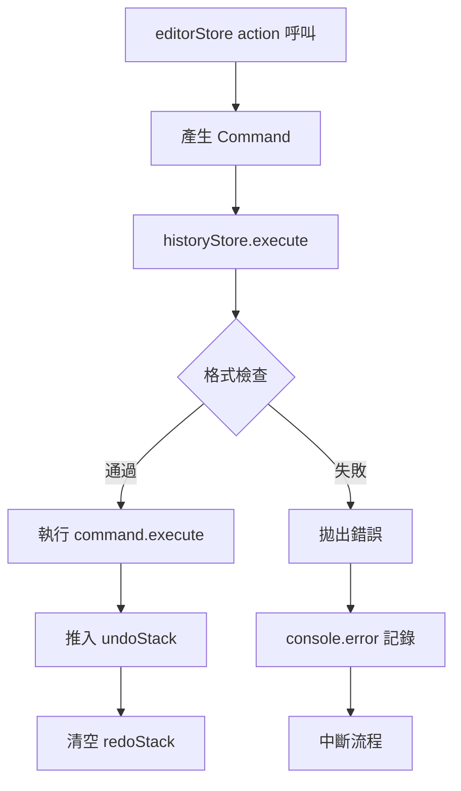

# D2 — History Format-Check 追蹤

**對應工項**：V5-D2

---

## 1. 工項目標

追蹤 **historyStore Command 格式一致性檢查機制**，確保：

- 所有 Command 符合 L1 介面規範
- 偵測並攔截格式錯誤的 Command
- 提供開發者友善的錯誤訊息

**負責人**：
- **CR-08**：dernoson（historyStore 主責）
- **CR-04**：aaaaa（監聽並協調）

---

## 2. Command 格式規範

### 2.1 標準格式

```typescript
interface Command {
  id: string;                    // UUID
  type: string;                  // Command 類型，如 'place-device'
  timestamp?: number;            // 執行時間戳（選用）
  execute(): void;               // 執行邏輯
  undo(): void;                  // 還原邏輯
}
```

### 2.2 常見錯誤格式

❌ **缺少 id**：

```typescript
{
  type: 'place-device',
  execute() { /* ... */ },
  undo() { /* ... */ },
  // 缺少 id！
}
```

❌ **缺少 undo**：

```typescript
{
  id: crypto.randomUUID(),
  type: 'place-device',
  execute() { /* ... */ },
  // 缺少 undo！
}
```

❌ **execute/undo 不是函式**：

```typescript
{
  id: crypto.randomUUID(),
  type: 'place-device',
  execute: null,  // 應為函式
  undo: null,
}
```

---

## 3. 格式檢查機制

### 3.1 在 historyStore.execute 中新增檢查

```typescript
// src/store/historyStore.ts

export const useHistoryStore = defineStore('history', () => {
  // ...
  
  function execute(command: Command) {
    // ========== 格式檢查 ==========
    if (!command.id || typeof command.id !== 'string') {
      console.error('[historyStore] Command 缺少有效的 id', command);
      throw new Error('[historyStore] Command 必須包含有效的 id');
    }
    
    if (!command.type || typeof command.type !== 'string') {
      console.error('[historyStore] Command 缺少有效的 type', command);
      throw new Error('[historyStore] Command 必須包含有效的 type');
    }
    
    if (typeof command.execute !== 'function') {
      console.error('[historyStore] Command.execute 不是函式', command);
      throw new Error('[historyStore] Command.execute 必須是函式');
    }
    
    if (typeof command.undo !== 'function') {
      console.error('[historyStore] Command.undo 不是函式', command);
      throw new Error('[historyStore] Command.undo 必須是函式');
    }
    // ==============================
    
    command.execute();
    undoStack.value.push(command);
    redoStack.value = [];
  }
  
  // ...
});
```

### 3.2 開發模式額外檢查

```typescript
// 僅在開發模式啟用
if (import.meta.env.DEV) {
  // 檢查 id 是否為 UUID 格式
  const uuidPattern = /^[0-9a-f]{8}-[0-9a-f]{4}-[1-5][0-9a-f]{3}-[89ab][0-9a-f]{3}-[0-9a-f]{12}$/i;
  if (!uuidPattern.test(command.id)) {
    console.warn('[historyStore] Command.id 不符合 UUID 格式', command.id);
  }
  
  // 檢查 type 是否為已知類型
  const knownTypes = [
    'place-device',
    'remove-devices',
    'move-devices',
    'rotate-device',
    'set-recipe',
    'paste-selection',
    'add-connection',
    'remove-connection',
  ];
  
  if (!knownTypes.includes(command.type)) {
    console.warn('[historyStore] 未知的 Command.type:', command.type);
  }
}
```

---

## 4. 測試覆蓋

### 4.1 新增單元測試

```typescript
// src/__tests__/store/historyStore.test.ts

describe('Command 格式檢查', () => {
  it('應拒絕缺少 id 的 Command', () => {
    const historyStore = useHistoryStore();
    
    const invalidCommand = {
      type: 'test',
      execute: vi.fn(),
      undo: vi.fn(),
    } as any;
    
    expect(() => {
      historyStore.execute(invalidCommand);
    }).toThrow('[historyStore] Command 必須包含有效的 id');
  });
  
  it('應拒絕缺少 undo 的 Command', () => {
    const historyStore = useHistoryStore();
    
    const invalidCommand = {
      id: crypto.randomUUID(),
      type: 'test',
      execute: vi.fn(),
    } as any;
    
    expect(() => {
      historyStore.execute(invalidCommand);
    }).toThrow('[historyStore] Command.undo 必須是函式');
  });
  
  it('應接受格式正確的 Command', () => {
    const historyStore = useHistoryStore();
    
    const validCommand: Command = {
      id: crypto.randomUUID(),
      type: 'test',
      execute: vi.fn(),
      undo: vi.fn(),
    };
    
    expect(() => {
      historyStore.execute(validCommand);
    }).not.toThrow();
    
    expect(validCommand.execute).toHaveBeenCalledOnce();
  });
});
```

---

## 5. 錯誤處理流程



---

## 6. CR-04 協調事項

### 6.1 editorStore 高階 action 需確保格式正確

所有 editorStore 的高階 action 必須產生符合格式的 Command：

```typescript
// src/store/editorStore.ts

export function placeDevice(node: FactoryNode) {
  const historyStore = useHistoryStore();
  
  const command: Command = {
    id: crypto.randomUUID(),  // ✅ 必須有 id
    type: 'place-device',     // ✅ 必須有 type
    execute() {               // ✅ 必須有 execute
      // ...
    },
    undo() {                  // ✅ 必須有 undo
      // ...
    },
  };
  
  historyStore.execute(command);
}
```

### 6.2 測試覆蓋確認

確保所有 CR-04 相關測試通過 historyStore 格式檢查：

```bash
pnpm test src/__tests__/store/editorStore.test.ts
pnpm test src/__tests__/composables/useFlowEngine.test.ts
```

---

## 7. 封鎖項目追蹤

| 封鎖項目 | 等待對象 | 預計解除時間 | 狀態 |
|----------|----------|--------------|------|
| 格式檢查實作 | CR-08 (dernoson) | 2026-06-10 | ⚠️ 進行中 |
| 測試案例新增 | CR-08 (dernoson) | 2026-06-10 | ⚠️ 進行中 |

---

## 8. 溝通記錄

### 2026-06-01

- **aaaaa → dernoson**：建議新增 Command 格式檢查
- **dernoson 回覆**：同意，預計 2026-06-10 實作

### 2026-06-05

- **dernoson**：提供格式檢查初版實作
- **aaaaa**：測試確認，建議新增開發模式額外檢查

### 2026-06-10（預計）

- **dernoson**：完成格式檢查與測試
- **aaaaa**：確認所有 CR-04 測試通過

---

## 9. 完成檢查清單

- [ ] historyStore.execute 新增格式檢查邏輯
- [ ] 開發模式新增額外檢查（UUID 格式、已知 type）
- [ ] 新增單元測試覆蓋所有錯誤情境
- [ ] 所有 editorStore actions 產生的 Command 格式正確
- [ ] `pnpm test` 全部通過
- [ ] 更新 `AGENT_CONTEXT.md` 記錄完成

---

*此文件對應 V5-D2 工項，持續更新直到實作完成。*
