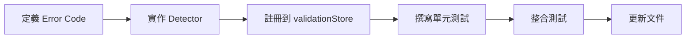

# D3 — Detector 開發 Checklist（給 shirone）

**對應工項**：V5-D3

---

## 1. 工項目標

提供 **CR-03 (shirone)** 一份完整的 Detector 開發檢查清單，涵蓋：

- Detector 開發標準流程
- 必須實作的項目
- 測試覆蓋要求
- 與 CR-04 的介面協調

**目標讀者**：shirone（CR-03 主責）

---

## 2. Detector 開發標準流程



---

## 3. Detector 實作檢查清單

### 3.1 檔案結構

```
src/lib/validation/detectors/
├── E001_deviceOverlap.ts       ✅ 範例
├── E003_outOfBaseRegion.ts      ⚠️ 待實作
├── W001_unmatchedMaterial.ts    ⚠️ 待實作
├── E004_portOccupied.ts         deprecated（此情境依現行 spec 不會發生）
├── E005_incompatibleConnection.ts  deprecated（此情境依現行 spec 不會發生）
├── E006_baseRegionViolation.ts  deprecated（與 `E003_outOfBaseRegion.ts` 指向同一現行代號）
└── index.ts                     ✅ 匯出所有 detectors
```

### 3.2 單個 Detector 必須包含

- [ ] **code**：Error Code（如 `'E001'`）
- [ ] **severity**：`'error'` 或 `'warning'`
- [ ] **detect 函式**：`(ctx: ValidationContext) => Alert[]`
- [ ] **單元測試**：至少 4 個案例
  - [ ] 正常情境（無錯誤）
  - [ ] 觸發錯誤情境
  - [ ] 邊界情境
  - [ ] 多重錯誤情境

---

## 4. Detector 實作範本

```typescript
// src/lib/validation/detectors/EXXX_description.ts

import type { Detector, ValidationContext, Alert } from '@/types/validation';

export const EXXX_description: Detector = {
  code: 'EXXX',
  severity: 'error',  // 或 'warning'
  
  detect(ctx: ValidationContext): Alert[] {
    const alerts: Alert[] = [];
    
    // 遍歷所有設備
    for (const device of ctx.devices) {
      // 檢查邏輯
      if (/* 錯誤條件 */) {
        alerts.push({
          code: 'EXXX',
          severity: 'error',
          deviceUid: device.uid,
          message: '錯誤訊息',
        });
      }
    }
    
    return alerts;
  },
};
```

---

## 5. 使用 geometryUtils（V5-B1 提供）

### 5.1 引入函式

```typescript
import {
  getOccupiedCells,
  cellsOverlap,
  isWithinBaseRegion,
} from '@/utils/geometryUtils';
```

### 5.2 使用範例

```typescript
detect(ctx: ValidationContext): Alert[] {
  const alerts: Alert[] = [];
  
  for (let i = 0; i < ctx.devices.length; i++) {
    for (let j = i + 1; j < ctx.devices.length; j++) {
      const deviceA = ctx.devices[i];
      const deviceB = ctx.devices[j];
      
      const defA = ctx.deviceDefs.get(deviceA.machineType);
      const defB = ctx.deviceDefs.get(deviceB.machineType);
      
      if (!defA || !defB) continue;
      
      const cellsA = getOccupiedCells(deviceA, defA);
      const cellsB = getOccupiedCells(deviceB, defB);
      
      if (cellsOverlap(cellsA, cellsB)) {
        alerts.push({
          code: 'E001',
          severity: 'error',
          deviceUid: deviceA.uid,
          message: `設備與 ${deviceB.uid} 重疊`,
        });
      }
    }
  }
  
  return alerts;
}
```

---

## 6. ValidationContext 完整欄位（V5-B2 更新）

```typescript
interface ValidationContext {
  devices: PlacedDevice[];
  connections: Connection[];
  deviceDefs: Map<string, DeviceDef>;
  baseRegion: BaseRegion;  // ✅ V5-B2 新增
}
```

**取得方式**：

```typescript
// src/composables/useValidation.ts 會自動組裝
const ctx: ValidationContext = {
  devices: editorStore.nodes,
  connections: editorStore.edges,
  deviceDefs: new Map(/* ... */),
  baseRegion: canvasStore.baseRegion,  // ✅ 從 canvasStore 取得
};
```

---

## 7. 單元測試範本

```typescript
// src/__tests__/lib/validation/detectors/EXXX_description.test.ts

import { describe, it, expect } from 'vitest';
import { EXXX_description } from '@/lib/validation/detectors/EXXX_description';
import type { ValidationContext } from '@/types/validation';

describe('EXXX_description', () => {
  it('正常情境：無錯誤', () => {
    const ctx: ValidationContext = {
      devices: [/* 正常設備 */],
      connections: [],
      deviceDefs: new Map(),
      baseRegion: 'wuling',
    };
    
    const alerts = EXXX_description.detect(ctx);
    expect(alerts).toHaveLength(0);
  });
  
  it('觸發錯誤情境', () => {
    const ctx: ValidationContext = {
      devices: [/* 錯誤設備 */],
      connections: [],
      deviceDefs: new Map(),
      baseRegion: 'wuling',
    };
    
    const alerts = EXXX_description.detect(ctx);
    expect(alerts).toHaveLength(1);
    expect(alerts[0].code).toBe('EXXX');
    expect(alerts[0].severity).toBe('error');
  });
  
  it('邊界情境', () => {
    // ...
  });
  
  it('多重錯誤情境', () => {
    // ...
  });
});
```

---

## 8. 與 CR-04 的介面協調

### 8.1 FlowEngine 依賴 validationStore

FlowEngine 會呼叫 `validationStore.hasBlockingError(deviceUid)` 來判斷設備是否參與計算：

```typescript
// src/composables/useFlowEngine.ts

function buildGraph() {
  const validationStore = useValidationStore();
  
  const devices = editorStore.nodes
    .filter(node => !validationStore.hasBlockingError(node.id))  // ✅ 過濾有 Error 的設備
    .map(/* ... */);
  
  // ...
}
```

### 8.2 CR-03 需確保

| 項目 | 說明 |
|------|------|
| `hasBlockingError(uid)` 正確 | 返回 `true` 時，FlowEngine 會略過該設備 |
| `alertsByDevice(uid)` 完整 | 返回該設備的所有 Alert |
| Detector 執行效能 | 單次 `run()` 應在 100ms 內完成 |

---

## 9. 註冊 Detector 到 validationStore

### 9.1 在 app 初始化時註冊

```typescript
// src/main.ts 或 src/app/App.vue

import { useValidationStore } from '@/store/validationStore';
import {
  E001_deviceOverlap,
  E003_outOfBaseRegion,
  W001_unmatchedMaterial,
  // ...
} from '@/lib/validation/detectors';

const validationStore = useValidationStore();

// 註冊所有 detectors（deprecated 項目不註冊）
validationStore.registerDetector(E001_deviceOverlap);
validationStore.registerDetector(E003_outOfBaseRegion);
validationStore.registerDetector(W001_unmatchedMaterial);
// ...
```

### 9.2 確認註冊成功

```typescript
console.log('已註冊 detectors:', validationStore.detectors.size);
// 預期：3（E001、E003、W001）
```

---

## 10. 整合測試檢查清單

- [ ] 在 FactoryCanvas 上擺放兩台重疊設備
- [ ] 確認 ProductionStats 顯示 Error 數量
- [ ] 確認 FlowEngine 略過有 Error 的設備
- [ ] 確認 undo/redo 後 validation 重新執行
- [ ] 確認移動設備後 validation 更新

---

## 11. 文件更新檢查清單

- [ ] 更新 `docs/shirone/README.md`
  - [ ] 新增已完成的 Detector 列表
  - [ ] 更新測試覆蓋率
- [ ] 更新 `spec/03_validation.md`（如有變更）
- [ ] 更新 `docs/dernoson/L1/shirone.md`

---

## 12. 完成定義（Definition of Done）

| 項目 | 標準 |
|------|------|
| 實作完整 | E001、E003、W001 detectors 全部實作（deprecated 項目免實作） |
| 測試覆蓋 | 每個 Detector 至少 4 個測試案例 |
| 型別正確 | `pnpm type-check` 無錯誤 |
| 格式正確 | `pnpm lint-check` 無錯誤 |
| 整合測試 | 所有 G1~G6 手動驗證通過 |
| 文件更新 | README 與 spec 同步更新 |

---

## 13. 常見問題 (FAQ)

### Q1：如何取得設備定義（DeviceDef）？

**A1**：從 `ctx.deviceDefs.get(device.machineType)` 取得。

### Q2：如何判斷設備是否超出基地範圍？

**A2**：使用 `isWithinBaseRegion(x, y, ctx.baseRegion)`（V5-B1 提供）。

### Q3：如何測試 Detector？

**A3**：參考 `E001_deviceOverlap.test.ts` 範例，至少包含 4 個測試案例。

### Q4：Detector 執行順序是否重要？

**A4**：不重要，所有 Detectors 平行執行，彼此獨立。

---

## 14. 參考文件

- [V5-B1 — geometryUtils 實作指南](./B1_geometry_utils.md)
- [V5-B2 — ValidationContext 完整性檢查](./B2_validation_context.md)
- [V5-B3 — E001 Detector 範例](./B3_e001_example.md)
- [spec/03_validation.md](../../../spec/03_validation.md)

---

*此文件對應 V5-D3 工項，提供給 shirone 作為 Detector 開發指南。*
