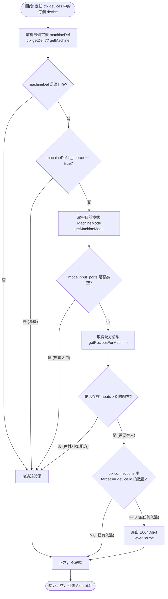

# E004 缺少輸入偵測器（E004_missingInput）實作記錄

| 項目 | 內容 |
|------|------|
| 工單代號 | [W1004-Z1](../work_dispatch/azure9572/1004/W1004-Z1_recipe_alerts_new_model.md) |
| 對應規格 | [D3 配方類警訊 (D3_recipe_alerts.md)](../roadmap/detail/D3_recipe_alerts.md) §4.3 |
| 主責人員 | azure9572 |
| 分支名稱 | `azure9572-w1004-z1-detectors` |
| 交付檔案 | `src/lib/validation/detectors/E004_missingInput.ts`<br>`src/__tests__/lib/validation/detectors/E004_missingInput.test.ts`<br>`src/app/dev/ValidationTest.vue`（註冊與測試鈕） |

---

## 1. 背景與目標

在先前的系統中，加工機若**完全未連接任何管線／輸送帶**，系統不會發出任何警告訊息。這是因為舊有系統僅上線了 `W001_unmatchedMaterial`（材料不符），而 W001 在無任何入邊時會直接 `continue`（將無入邊情境留給 E004 處理）。由於 E004 先前停留在舊分支未合入 master，導致「完全沒接線的機器」在畫面上呈現零警示。

本任務目標為以 **master 現行新模型**（`src/types/validation.ts` 的 `Detector` / `ValidationContext` 介面）為準，正式實作純函式偵測器 `E004_missingInput` 與對應單元測試，並接上開發驗證頁面。

---

## 2. 參考檔案與系統架構

| 檔案路徑 | 作用與參考內容 |
|----------|----------------|
| `src/types/validation.ts` | 核心型別定義：`Detector`、`ValidationContext`、`Alert`、`AlertLevel`。 |
| `src/types/machine.ts` | 機器靜態結構定義：`Machine`、`MachineMode`、`PortDef` 與輔助函式 `getMachineMode`。 |
| `src/types/graph.ts` | 藍圖圖結構型別：`FactoryNode`（設備節點）、`FactoryEdge`（管線邊）。 |
| `src/types/flow.ts` | 配方型別定義：`RecipeDef`、`RecipeItem`。 |
| `src/data/machines.ts` | 設備靜態查詢：`getMachine(name)`。 |
| `src/data/products.ts` | 配方靜態查詢：`getRecipesForMachine(machineName, modeId)`。 |
| `src/lib/validation/detectors/W001_unmatchedMaterial.ts` | 既有偵測器結構參考（純函式規範、無 Pinia/Vue 依賴）。 |
| `src/app/dev/ValidationTest.vue` | 驗證系統測試頁：透過 `validationStore.registerDetector` 掛載並呈現警示。 |

---

## 3. 使用的資料結構

### 3.1 驗證上下文（ValidationContext）
由 composable（`useValidation.buildContext()`）組裝傳入偵測器：
- `devices: FactoryNode[]`：畫布上所有已擺放的節點清單。節點資料 `node.data` 包含 `machineType`（設備名稱，如 `'精煉爐'`）、`machineMode`（運作模式 id）、`recipeIndex`。空間座標已轉為**格子座標**。
- `connections: FactoryEdge[]`：畫布上所有連線邊。每條連線包含 `source`（來源節點 id）、`target`（目標節點 id）。
- `getDef(machineType: string): Machine | undefined`：由外部注入之設備定義快查函式。

### 3.2 機器與模式定義（Machine & MachineMode）
- `Machine.is_source: boolean`：是否為地區資源輸出點（產線起點，如採礦機）。
- `Machine.modes: MachineMode[]`：設備支援的運作型態列表。
- `MachineMode.input_ports: readonly PortDef[]`：該型態擁有的輸入埠列表。

### 3.3 警示資料結構（Alert）
依 CR-03 規範，每個警示產出必填 6 個欄位：
```typescript
interface Alert {
  uid: string;                    // 唯一識別碼，使用 crypto.randomUUID()
  level: 'error';                 // 警示等級，E004 為 'error'
  code: 'E004';                   // 警示代碼
  message: string;                // 人類可讀訊息，如 "缺少輸入：精煉爐 需要輸入材料但未連接任何輸入管線"
  relatedDeviceUids: string[];    // 關聯設備 uid 列表（填入 device.id）
  relatedConnectionUids: string[];// 關聯管線 uid 列表（E004 為 []）
}
```

---

## 4. 演算法與判斷邏輯

### 4.1 核心規則（D3 §4.3）
- **判定條件**：該設備目前運作模式（mode）存在**需要輸入材料**的配方，但畫布上**沒有任何管線連接至此設備**（入邊數量為 0）。
- **排除條件**：
  1. `is_source: true` 的源類機器（如採礦機、資源輸出點）。
  2. 該模式下無輸入埠（`input_ports.length === 0`）之設備。
  3. 該模式下無任何需要輸入的配方（例如分流器無配方，或無需耗材即可運轉之設備）。

### 4.2 邏輯流程圖



---

## 5. 程式碼實作說明

檔案路徑：`src/lib/validation/detectors/E004_missingInput.ts`

```typescript
import type { Alert, Detector, ValidationContext } from '@/types/validation';
import { getMachine } from '@/data/machines';
import { getRecipesForMachine } from '@/data/products';
import { getMachineMode } from '@/types/machine';

export const E004_missingInput: Detector = {
    code: 'E004',
    level: 'error',
    run(ctx: ValidationContext): Alert[] {
        const alerts: Alert[] = [];

        for (const device of ctx.devices) {
            const machineType = device.data?.machineType ?? device.data?.label ?? device.id;
            const machineDef = ctx.getDef
                ? ctx.getDef(machineType) ?? getMachine(machineType)
                : getMachine(machineType);

            // 若查無設備定義，或是地區資源輸出點（源機），不套用 E004
            if (!machineDef || machineDef.is_source) {
                continue;
            }

            const mode = getMachineMode(machineDef, device.data?.machineMode);
            // 若該型態沒有任何輸入埠，略過
            if (!mode || mode.input_ports.length === 0) {
                continue;
            }

            // 取得該設備在目前 mode 下的所有配方
            const recipes = getRecipesForMachine(machineDef.name, mode.id);
            // 該型態下必須存在「需要輸入」的配方才需檢查入邊
            const hasRecipeRequiringInput = recipes.some((recipe) => recipe.inputs.length > 0);
            if (!hasRecipeRequiringInput) {
                continue;
            }

            // 檢查是否有任何連接至此設備的管線（入邊）
            const inEdges = ctx.connections.filter((c) => c.target === device.id);
            if (inEdges.length === 0) {
                alerts.push({
                    uid: crypto.randomUUID(),
                    code: 'E004',
                    level: 'error',
                    message: `缺少輸入：${machineDef.name} 需要輸入材料但未連接任何輸入管線`,
                    relatedDeviceUids: [device.id],
                    relatedConnectionUids: [],
                });
            }
        }

        return alerts;
    },
};
```

### 設計特點
1. **純函式架構**：不依賴任何外部可變狀態，不匯入 Pinia Store 或 Vue Reactivity。多次執行相同輸入保證產生一致輸出。
2. **多模式（MachineMode）感知**：依據節點資料的 `machineMode` 查詢對應輸入埠與可用配方，若機器切換至無需輸入的模式，不會發生誤報。
3. **安全容錯**：對 `machineDef`、`mode` 及 `ctx.getDef` 均設有回退防護，避免藍圖資料不全時拋出未捕捉例外。

---

## 6. 單元測試設計

檔案路徑：`src/__tests__/lib/validation/detectors/E004_missingInput.test.ts`

透過 Vitest 對 `@/data/machines` 與 `@/data/products` 進行 mock，共規劃 9 個測試案例：

| 測試案例 | 驗證重點 | 預期結果 |
|----------|----------|----------|
| **T1** | 空藍圖無設備 | 回傳空陣列（長度 0） |
| **T2** | 源機（`is_source: true`）且無入邊 | 不觸發 E004 |
| **T3** | 加工機已有入邊連接（`target === device.id`） | 不觸發 E004 |
| **T4** | 加工機需輸入且無任何入邊 | 觸發 1 筆 E004，驗證 `code`、`level: 'error'`、`message`、`relatedDeviceUids` |
| **T5** | 設備無輸入埠（`input_ports: []`） | 不觸發 E004 |
| **T6** | 設備無需要輸入之配方（如分流器、免材料配方） | 不觸發 E004 |
| **T7** | 多設備混合（一台已連線、一台未連線） | 僅未連線之加工機精確報出 E004 |
| **T8** | 查無定義之未知設備 | 略過不崩潰，不觸發警示 |
| **T9** | 依 `machineMode` 切換需求（craft_mode 需輸入 vs idle_mode 免輸入） | craft_mode 報錯，idle_mode 不報錯 |

**測試執行結果**：9 tests passed 全數通過。

---

## 7. 開發驗證頁面串接

在 `src/app/dev/ValidationTest.vue` 中完成註冊與測試按鈕配置：
1. **註冊偵測器**：
   ```typescript
   import { E004_missingInput } from '@/lib/validation/detectors/E004_missingInput';
   validationStore.registerDetector(E004_missingInput);
   ```
2. **新增測試按鈕**：
   - 按鈕名稱：`➕ 新增沒接線的機器（精煉爐 @20,20，觸發 E004）`
   - 點擊後於畫布放置未連接管線的精煉爐節點。
   - 畫面下方「目前警示」區塊隨即觸發監聽重算，顯示 `E004 缺少輸入：精煉爐 需要輸入材料但未連接任何輸入管線`。
   - 點擊「清空所有設備」後，警示數量正常歸零。
