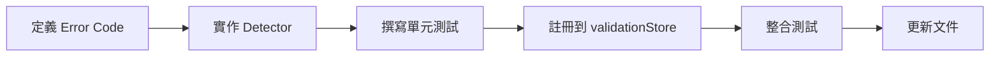

# Detector 開發 Checklist（CR-03 主責）

**版本**：V5  
**最後更新**：2026-06-06  
**維護者**：shirone (CR-03) + aaaaa (CR-04)  
**適用對象**：CR-03 開發者

---

## 目錄

1. [開發流程概覽](#開發流程概覽)
2. [Detector 實作清單](#detector-實作清單)
3. [開發範本與工具](#開發範本與工具)
4. [測試要求](#測試要求)
5. [與 FlowEngine 的協調](#與-flowengine-的協調)
6. [完成定義](#完成定義)
7. [常見問題](#常見問題)

---

## 開發流程概覽



每個 Detector 都必須經過上述 6 個步驟。

---

## Detector 實作清單

### 檔案結構

```
src/lib/validation/detectors/
├── E001_deviceOverlap.ts       ✅ 範例實作（可參考）
├── E003_outOfBaseRegion.ts      ⚠️ 待實作
├── W001_unmatchedMaterial.ts    ⚠️ 待實作
├── E004_portOccupied.ts         deprecated（此情境依現行 spec 不會發生）
├── E005_incompatibleConnection.ts  deprecated（此情境依現行 spec 不會發生）
├── E006_baseRegionViolation.ts  deprecated（與 `E003_outOfBaseRegion.ts` 指向同一現行代號）
└── index.ts                     ✅ 匯出檔案
```

### 各 Detector 狀態追蹤

| Code | 名稱 | 狀態 | 測試 | 文件 | 負責人 |
|------|------|------|------|------|--------|
| E001 | 設備重疊 | ✅ 完成 | ✅ 8 個案例 | ✅ | shirone |
| E003 | 超出基地框線 | ⚠️ 待實作 | ❌ | ❌ | shirone |
| W001 | 材料組合無法處理 | ⚠️ 待實作 | ❌ | ❌ | shirone |
| E004 | Port 佔用 | deprecated | — | — | shirone |
| E005 | 連接不相容 | deprecated | — | — | shirone |
| E006 | 基地範圍違規 | deprecated（同 E003） | — | — | shirone |

**更新方式**：完成一個 Detector 後，將狀態改為 ✅ 並填寫測試數量。

---

## 開發範本與工具

### Detector 實作範本

```typescript
// src/lib/validation/detectors/EXXX_description.ts

import type { Detector, ValidationContext, Alert } from '@/types/validation';

export const EXXX_description: Detector = {
  code: 'EXXX',
  severity: 'error',  // 或 'warning'
  
  detect(ctx: ValidationContext): Alert[] {
    const alerts: Alert[] = [];
    
    // 遍歷所有設備
    for (const device of ctx.devices) {
      // 檢查邏輯
      if (/* 錯誤條件 */) {
        alerts.push({
          id: crypto.randomUUID(),
          code: 'EXXX',
          severity: 'error',
          deviceUid: device.uid,
          message: '錯誤訊息',
        });
      }
    }
    
    return alerts;
  },
};
```

### 可用的 geometryUtils（V5-B1 提供）

```typescript
import {
  getOccupiedCells,
  cellsOverlap,
  isWithinBaseRegion,
  isDeviceWithinBaseRegion,
} from '@/utils/geometryUtils';

// 1. 計算設備佔據的所有格子（考慮旋轉）
const cells = getOccupiedCells(device, def);
// 回傳 Set<"x,y">，例如 Set { "5,10", "5,11", "6,10", "6,11" }

// 2. 檢查兩個格子集合是否有重疊
const hasOverlap = cellsOverlap(cellsA, cellsB);

// 3. 檢查座標是否在基地範圍內（null 基地永遠回傳 true）
const inBounds = isWithinBaseRegion(x, y, canvasStore.baseRegion);

// 4. 檢查整個設備是否在基地範圍內
const deviceInBounds = isDeviceWithinBaseRegion(device, def, canvasStore.baseRegion);
```

**E001 已使用這些函式，可作為參考範例。**

### ValidationContext 完整欄位（V5-B2）

```typescript
interface ValidationContext {
  devices: PlacedDevice[];          // 所有已擺放設備
  connections: Connection[];        // 所有管線連接
  getDef: (machineType: string) => MachineDef | undefined;  // 查詢設備定義
  baseRegion: BaseRegion;           // 'wuling' | 'valley4' | null
}
```

**使用範例**：

```typescript
detect(ctx: ValidationContext): Alert[] {
  const alerts: Alert[] = [];
  
  for (const device of ctx.devices) {
    const def = ctx.getDef(device.machineType);
    if (!def) {
      // 找不到設備定義，跳過
      continue;
    }
    
    // 使用 def 進行檢查
    // ...
  }
  
  return alerts;
}
```

---

## 測試要求

### 單元測試範本

```typescript
// src/__tests__/lib/validation/detectors/EXXX_description.test.ts

import { describe, it, expect } from 'vitest';
import { EXXX_description } from '@/lib/validation/detectors/EXXX_description';
import type { ValidationContext } from '@/types/validation';

describe('EXXX_description', () => {
  it('H1：無設備時不報錯', () => {
    const ctx: ValidationContext = {
      devices: [],
      connections: [],
      getDef: () => undefined,
      baseRegion: null,
    };
    
    const alerts = EXXX_description.detect(ctx);
    expect(alerts).toHaveLength(0);
  });
  
  it('H2：正常設備不報錯', () => {
    const ctx: ValidationContext = {
      devices: [
        { uid: 'device1', machineType: 'refinery', x: 5, y: 10, rotation: 0 },
      ],
      connections: [],
      getDef: (machineType) => ({
        width: 2,
        height: 2,
        // ...
      }),
      baseRegion: 'wuling',
    };
    
    const alerts = EXXX_description.detect(ctx);
    expect(alerts).toHaveLength(0);
  });
  
  it('H3：觸發錯誤情境', () => {
    const ctx: ValidationContext = {
      devices: [
        { uid: 'device1', machineType: 'refinery', x: 5, y: 10, rotation: 0 },
        // 設定觸發錯誤的情境
      ],
      connections: [],
      getDef: (machineType) => (/* ... */),
      baseRegion: 'wuling',
    };
    
    const alerts = EXXX_description.detect(ctx);
    expect(alerts.length).toBeGreaterThan(0);
    expect(alerts[0].code).toBe('EXXX');
    expect(alerts[0].severity).toBe('error');
  });
  
  it('H4：邊界情境', () => {
    // 測試極端情況
  });
  
  it('H5：多重錯誤情境', () => {
    // 測試多個設備同時觸發錯誤
  });
});
```

### 最低測試要求

每個 Detector 至少需要以下 4 個測試案例：

| 案例 | 說明 |
|------|------|
| **H1** | 無設備時不報錯（空陣列） |
| **H2** | 正常設備不報錯（符合規則） |
| **H3** | 觸發錯誤情境（至少 1 個 Alert） |
| **H4** | 邊界情境（例如剛好在邊界上） |

建議額外測試：
- **H5**：多重錯誤情境（多個設備同時觸發）
- **H6**：設備定義缺失時的處理（getDef 返回 undefined）
- **H7**：旋轉設備的檢查（rotation 0/1/2/3）
- **H8**：不同基地範圍的檢查（wuling / valley4 / null）

---

## 與 FlowEngine 的協調

### FlowEngine 如何使用 validationStore

FlowEngine 會在計算前過濾掉有 Error 的設備：

```typescript
// src/composables/useFlowEngine.ts

function buildGraph() {
  const validationStore = useValidationStore();
  
  const devices = editorStore.nodes
    .filter(node => !validationStore.hasBlockingError(node.id))  // ✅ 過濾有 Error 的設備
    .map(/* ... */);
  
  // 繼續計算流量
}
```

### CR-03 需確保的事項

| 項目 | 說明 |
|------|------|
| **hasBlockingError 正確** | 返回 `true` 時，FlowEngine 會略過該設備 |
| **alertsByDevice 完整** | 返回該設備的所有 Alert |
| **效能要求** | 單次 `detect()` 應在 100ms 內完成 |

### 測試與 FlowEngine 的整合

```typescript
// 範例：確認有 Error 的設備不參與流量計算

import { useEditorStore } from '@/store/editorStore';
import { useValidationStore } from '@/store/validationStore';
import { useFlowStore } from '@/store/flowStore';

const editorStore = useEditorStore();
const validationStore = useValidationStore();
const flowStore = useFlowStore();

// 擺放兩台重疊的設備
editorStore.placeDevice({
  id: 'device1',
  type: 'default',
  position: { x: 100, y: 100 },
  data: { machineType: 'refinery', recipeIndex: 0, rotation: 0 },
});

editorStore.placeDevice({
  id: 'device2',
  type: 'default',
  position: { x: 100, y: 100 },  // 重疊！
  data: { machineType: 'crusher', recipeIndex: 0, rotation: 0 },
});

// 等待 validation 完成
await nextTick();

// 確認有 Error
console.log(validationStore.hasBlockingError('device1'));  // true
console.log(validationStore.hasBlockingError('device2'));  // true

// 確認 FlowEngine 沒有計算這些設備的流量
console.log(flowStore.nodeEfficiencies.has('device1'));    // false
console.log(flowStore.nodeEfficiencies.has('device2'));    // false
```

---

## 完成定義（Definition of Done）

### 單個 Detector 的完成標準

- [ ] **實作完成**：detector 檔案建立並匯出
- [ ] **測試覆蓋**：至少 4 個測試案例全部通過
- [ ] **型別正確**：`pnpm type-check` 無錯誤
- [ ] **程式碼規範**：`pnpm lint-check` 無警告
- [ ] **文件更新**：在本檔案更新狀態為 ✅

### 整體 CR-03 的完成標準

| 項目 | 標準 |
|------|------|
| **實作完整** | E001、E003、W001 detectors 全部實作（deprecated 項目免實作） |
| **測試覆蓋** | 每個 Detector 至少 4 個案例，總計 12+ 個測試 |
| **型別檢查** | `pnpm type-check` 無錯誤 |
| **Lint 檢查** | `pnpm lint-check` 無警告 |
| **格式檢查** | `pnpm format-check` 無錯誤 |
| **整合測試** | 所有 G1~G6 手動驗證通過 |
| **文件更新** | [shirone/README.md](./README.md) 同步更新 |

---

## 常見問題（FAQ）

### Q1：如何取得設備定義（MachineDef）？

**A1**：從 `ctx.getDef(device.machineType)` 取得。如果返回 `undefined`，表示設備定義不存在，應跳過該設備。

```typescript
const def = ctx.getDef(device.machineType);
if (!def) {
  console.warn(`[Detector] Unknown machineType: ${device.machineType}`);
  continue;
}
```

---

### Q2：如何判斷設備是否超出基地範圍？

**A2**：使用 `isDeviceWithinBaseRegion(device, def, ctx.baseRegion)`（V5-B1 提供）。

```typescript
import { isDeviceWithinBaseRegion } from '@/utils/geometryUtils';

if (!isDeviceWithinBaseRegion(device, def, ctx.baseRegion)) {
  alerts.push({
    id: crypto.randomUUID(),
    code: 'E002',
    severity: 'error',
    deviceUid: device.uid,
    message: '設備超出基地範圍',
  });
}
```

---

### Q3：如何測試 Detector？

**A3**：參考 `E001_deviceOverlap.test.ts` 範例，建立至少 4 個測試案例。執行測試：

```bash
pnpm test E001  # 測試單個 Detector
pnpm test       # 測試所有 Detectors
```

---

### Q4：Detector 執行順序是否重要？

**A4**：不重要。所有 Detectors 平行執行，彼此獨立，不應依賴其他 Detector 的結果。

---

### Q5：如何在開發時測試 Detector？

**A5**：使用 `/dev/flow-engine` 測試頁面，可以手動擺放設備並查看 validation 結果。

**存取方式**：
1. 啟動開發伺服器：`pnpm dev`
2. 前往：`http://localhost:5173/dev/flow-engine`
3. 使用 H1~H6 preset 快速建立測試場景

---

### Q6：Alert 的 id 欄位需要填什麼？

**A6**：使用 `crypto.randomUUID()` 產生唯一 ID。

```typescript
alerts.push({
  id: crypto.randomUUID(),  // ✅ 唯一 ID
  code: 'E001',
  severity: 'error',
  deviceUid: device.uid,
  message: '設備重疊',
});
```

---

### Q7：如何處理旋轉設備的檢查？

**A7**：`getOccupiedCells` 已經考慮旋轉（rotation 0/1/2/3），直接使用即可。

```typescript
const cells = getOccupiedCells(device, def);
// cells 已經根據 device.rotation 計算正確的佔據格子
```

---

## 參考文件

- 📘 [Spec: Validation](../../spec/03_validation.md) — 完整規格定義
- 📗 [V5-B1 — geometryUtils](../aaaaa/dev/dev_v5/B1_geometry_utils.md) — 幾何工具函式
- 📙 [V5-B3 — E001 範例](../aaaaa/dev/dev_v5/B3_e001_example.md) — 完整實作範例
- 🔧 `/dev/flow-engine` — 開發測試頁面
- 🔧 `/dev/graph-viz` — 圖結構可視化

---

**文件版本**：V5  
**最後更新**：2026-06-06  
**維護者**：shirone (CR-03) + aaaaa (CR-04)  
**問題回報**：在 CR-03 channel 提問或直接找 aaaaa
