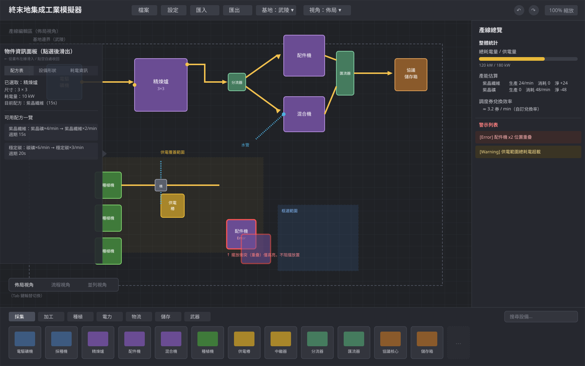
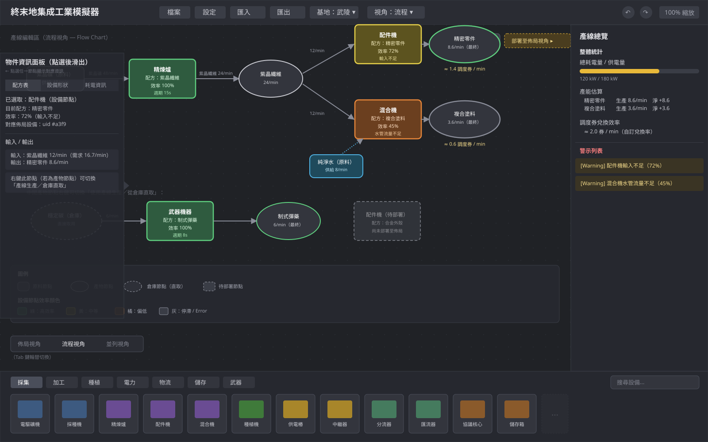

# 明日方舟：終末地｜集成工業模擬器
# Top Spec

- **版本：** v0.3
- **平台：** 純前端網頁（Vue 3 + Vite，無後端）
- **目標受眾：** 一般玩家 ＋ 進階玩家（兩者兼顧）；本文件同時供開發同仁與 AI 輔助開發使用

---

## 1. 專案概述

提供一個忠實還原《明日方舟：終末地》集成工業系統的網頁模擬器，讓玩家可以在遊戲外預先規劃產線配置、即時估算產量與效率，並將結果匯出為可分享的記錄檔。

**核心價值：**
- **先試後蓋**：不用在遊戲內反覆拆裝，直接在網頁沙盒規劃
- **即時回饋**：每次擺放或連線後立即看到流量與效率估算
- **社群共享**：匯出記錄檔既可瀏覽分享，也可匯回繼續編輯

---

## 2. 技術選型

| 層次 | 技術 | 說明 |
|------|------|------|
| 框架 | **Vue 3 + Vite** | 團隊熟悉；Nuxt UI v3 支援純 Vue + Vite |
| UI 元件 | **Nuxt UI v3** | 125+ 元件，Sidebar、Table、Modal、Tooltip 等直接套用 |
| 狀態管理 | **Pinia** | Vue 官方推薦，與 vueUse 整合無縫 |
| 工具函式 | **vueUse** | `useMagicKeys` 管理快捷鍵、`useLocalStorage` 自動存檔 |
| 樣式 | **Tailwind CSS v4** | Nuxt UI v3 內建 |
| 畫布渲染 | **Vue Flow** | PoC 驗證通過（snap-to-grid、多格設備佔位、Port 連線），已採用並實作於 `FactoryCanvas.vue` |
| 資料格式 | **JSON**（設備庫）＋ **HTML**（記錄檔） | 見核心需求 6 |

---

## 3. 核心需求概述

本章依七大核心需求方向分組，各方向下轄一至多個 CR（Core Requirement）

### 大方向一：使用者編輯行為

#### CR-01　產線擺設編輯區

**畫面示意（佈局視角）：**

- 遊戲格線：精確還原遊戲格線，設備依佔格數擺放
- 設備編輯行為：旋轉 / 移動 / 擺放 / 刪除 / 複製
- 多設備框選後，可一併進行上述編輯行為
- 編輯行為可無限復原 / 取消復原（Ctrl+Z / Ctrl+Y，由 CR-08 統一管理）
- 點選設備後，顯示物件資訊面板：
  - 可使用配方一覽
  - 當前運行配方（流速）
  - 當前設備錯誤警示

→ 詳見 `01_canvas_and_devices.md`

#### CR-11　產線擺設編輯區 - 工具列
- 於畫面下方列出所有可用設備
- 使用與終末地相同的分類方式，用 Tab 的方式切換不同類設備顯示
- 使用者可直接點選某設備，顯示物件資訊面板
- 使用者在任意視角都能直接拖動出來設備到畫面上放置

→ 詳見 `11_toolbar.md`

#### CR-02　產線擺設編輯區 - 管線連接
- 管線編輯行為：移動 / 擺放 / 刪除 / 複製
- 點選管線後，顯示物件資訊面板
- 可跟著設備一起框選，一併進行編輯行為
- 編輯行為可無限復原 / 取消復原（Ctrl+Z / Ctrl+Y，由 CR-08 統一管理）
- 設備編輯行為（CR-01）下，設備接口對到相應 type 的管線時，自動連接
- 切換至管線模式後，所有設備管線接口自動高亮
- 依連接點 type 自動判斷拉出來的是傳送帶 / 水管，並自動吸附至連接點
- 自動處理情境：
  - 路徑跨越現有管線 → 自動插入物流橋
  - **Phase 2：** 從管線中途拉出新管線 → 自動生成分流器；拉至已有管線中途 → 自動生成匯流器（Phase 1 分流器 / 匯流器仍為可放置設備，僅不支援此自動生成互動，需使用者從工具列手動擺放並自行連接管線）
- 彎折點由使用者手動點選決定；放置後不可編輯，需調整路徑須刪除重建
  - **Phase 3：** 自動路徑規劃，彎折點依當前空間自動生成

→ 詳見 `02_pipeline.md`

#### CR-08　操作歷史（History）
- CR-01（含 CR-02）、CR-05 的所有佈局狀態變更統一由操作歷史 store 管理，採 Command Pattern 實作
- 支援無限制復原 / 取消復原（Ctrl+Z / Ctrl+Y），任一視角操作均進入同一歷史佇列
- Session 結束後歷史清空，不持久化

→ 詳見 `08_history.md`

---

### 大方向二：視角切換

**畫面示意（流程視角）：**

#### CR-05　配方流程設計（Flow Chart 視角）— 視角切換部分
- 編輯區左下角提供視角切換控項（Tab 鍵輪替），支援三種模式，共用同一份產線資料：
  - **佈局視角**：完整畫布，設備擺放與管線操作
  - **流程視角**：Flow Chart 呈現產物流向、設備、效率與配比
  - **並列視角**（Phase 2）：佈局與流程並排（左右 / 上下可切換），點選任一方另一方自動導覽，編輯任一方另一方即時聯動

→ 詳見 `05_recipe_flow.md`

---

### 大方向三：配方流程部署

#### CR-05　配方流程設計（Flow Chart 視角）— 部署部分
- 流程視角可選擇中間產物的生成流程或直接從倉庫取用；新增流程配方後顯示「切換視角以導入」提示，切回佈局視角時滑鼠自動拖曳對應設備供使用者選擇擺放位置
- **Phase 2：** 新增流程配方、選擇中間產物流程、一鍵導入設備至佈局視角；並列視角編輯聯動

→ 詳見 `05_recipe_flow.md`

#### CR-07　多目標優化產能推導 — 部署部分
- 完成後走「切換視角以導入」流程，進入佈局視角

→ 完整內容見大方向七；詳見 `07_optimization.md`

---

### 大方向四：警示系統

#### CR-03　產線擺設編輯區 - 擺設位置衝突
- 所有設備編輯行為 / 管線編輯行為都需計算一次擺設衝突（含設備重疊、佈線違法、超出基地框線）
- 出現擺設衝突時不阻擋該次編輯，僅在有衝突的物件上以紅色高亮顯示
- 物件資訊面板顯示衝突
- 產線總覽面板顯示衝突

→ 詳見 `03_validation.md`

#### CR-09　產線流量計算 - 配方警示
- 配方警示涵蓋以下情境：
  - **材料組合無法處理**（Warning）：設備輸入材料組合不符配方，無法被該設備任一配方使用（可能有多種輸入材料）
  - **輸入缺失**（Error）：設備配方明確要求輸入時，未接入任何輸入（含部分輸入缺失，可能有多種輸入）
  - **輸出缺失**（Error）：設備配方明確要求輸出時，未接出任何輸出（含部分輸出缺失，可能有多種輸出）
  - **輸入不足**（Warning）：管線輸入端流量不足以滿足下游所需；含輸入端缺失（此時輸入端流量視為 0）
  - **輸出阻塞**（Warning）：管線輸出端無法排出全部流量；含輸出端缺失（此時輸出端流量視為 0）
- 不阻擋操作，於對應設備 / 管線上標示，物件資訊面板與產線總覽面板列出

→ 詳見 `09_recipe_warning.md`

#### CR-10　產線電力計算 — 警示部分
- 電力警示涵蓋以下情境：
  - **設備未供電**（Warning）：該設備完全處在供電樁範圍外
  - **總耗電量超過本區域供電量**（Warning）：使用者自訂該區總供電量時，所有處在供電樁範圍內設備的總計耗電量超過供電量
- 不阻擋操作，於對應設備上標示，物件資訊面板與產線總覽面板列出

→ 完整內容見大方向五；詳見 `10_power_calculation.md`

---

### 大方向五：自動化估算

#### CR-04　流量模擬與產能估算
- 設備擺放、管線變動、產物設定變更後即時重新計算，於設備、管線、產線起點／終點顯示估算數值
- 有 Error 的設備與管線略過流量估算
- 產線總覽面板顯示：
  - 當前佈局總耗電量與供電量比較
  - 當前總產能估算（依品項列出生產 / 消耗 / 淨產量）
  - 產能換算調度券兌換效率（兌換率由使用者自訂）

→ 詳見 `04_flow_simulation.md`

#### CR-10　產線電力計算 — 計算部分
- 供電樁具有 N×N 方形供電範圍
- 設備須部分處於供電樁範圍內才會運作，並耗用該設備設定的耗電量
- 總供電量由使用者自訂；未設定時視為無限供電
- 計算結果供 CR-04 產線總覽面板顯示（總耗電量與供電量比較），以及大方向四警示部分判斷

→ 完整內容見大方向四；詳見 `10_power_calculation.md`

---

### 大方向六：匯入匯出

#### CR-06　藍圖匯入 / 匯出
- **匯出記錄檔（.html）**：內容含完整產線設備佈局、流程 Flow Chart、產能估算、警示列舉；檔案分兩層——人類可讀層（靜態呈現 + 輕量互動）、機器可讀層（內嵌完整 JSON 供匯回）
- **匯入**：支援 `.html` 與 `.json`，含跨版本 migrate 邏輯（Zod 實作，靜默執行），僅在 parse error 時顯示錯誤訊息

→ 詳見 `06_export_import.md`

---

### 大方向七：多目標優化

#### CR-07　多目標優化產能推導
- 獨立頁面：使用者設定調度券兌換率（供最大化目標函式換算）、部分產物硬性產量需求、當前可用原料產能（以傳送帶條數／流量為單位）
- 系統以連續線性規劃（LP）推導使調度券產出最大化的最佳配方流量分配，結果呈現各配方分配流量、對應設備台數、運行效率
- 使用者可微調台數或流量（兩者聯動：調台數反推流量、調流量換算建議台數並標示效率）
- 完成後走「切換視角以導入」流程，進入佈局視角（詳見大方向三：配方流程部署）

→ 詳見 `07_optimization.md`

---

## 4. 階段性目標

### Phase 1 — MVP（可用的產線規劃器 + 流程視角初體驗）
目標：能擺設備、拉管線、看到即時估算，並初步體驗流程視角。

- CR-01 基礎畫布與設備擺放（格子制、旋轉 / 移動 / 擺放 / 刪除 / 複製、框選、物件資訊面板）
- CR-11 工具列（設備分類 Tab 切換、點選顯示設備資訊、拖曳擺放）
- CR-02 管線連接（管線模式、自動吸附、物流橋自動生成、手動彎折點）
- CR-03 擺設衝突類警示（設備重疊、佈線違法）
- CR-04 基礎流量估算（即時重算、產線總覽面板、總耗電量顯示）
- CR-10 電力計算（供電樁範圍判定、耗電量加總、供電量比較）
- CR-05 流程視角基礎（佈局 / 流程視角切換）
- CR-08 操作歷史（無限制復原 / 取消復原）

### Phase 2 — 完整模擬體驗
目標：警示系統、流程規劃與分享功能完整上線。

- CR-09 流量 / 配方警示類
- CR-10 電力警示（設備未供電、總耗電量超過供電量）
- CR-04 調度券兌換效率計算
- CR-02 分流器 / 匯流器自動生成（含截斷模式切換）
- CR-05 並列視角上線（點選導覽聯動、上下 / 左右並排切換）、新增流程配方、中間產物選擇、一鍵導入設備、並列視角編輯聯動
- CR-06 藍圖匯出（完整 HTML 記錄檔）、匯入與跨版本 migrate

### Phase 3 — 進階自動化
目標：自動佈線與產能優化。

- CR-02 自動路徑規劃（彎折點自動運算）
- CR-07 多目標優化產能推導（LP 求解、台數 / 流量微調、部署至佈局視角）

---

## 5. 跨功能設計原則

- **資料單一來源**：畫布狀態、連線狀態、警示狀態統一存於 Pinia store，佈局視角與流程視角共用同一份資料
- **即時重算**：任何狀態變更後，FlowEngine 自動觸發重新計算（debounce 處理高頻操作）；有 Error 的節點略過估算
- **設備資料庫**：完整照搬遊戲所有設備與配方，以 `/data/devices.ts` 維護（TypeScript 定義，受型別系統保護）；每個接口含明確 type 定義（傳送帶 / 水管），供管線模式自動判斷
- **流量單位**：以傳送帶滿載流量（30/min）為基礎物流單位，設備台數為向上取整的結果
- **操作歷史單一佇列**：CR-01（含 CR-02）、CR-05 的所有佈局操作統一進入 `useHistoryStore`，任何視角的 Ctrl+Z / Ctrl+Y 均作用於同一歷史，Session 結束清空
- **自動存檔**：透過 vueUse `useLocalStorage` debounce 500ms 寫入，避免資料遺失
- **記錄檔自包含**：匯出 HTML 無外部依賴，離線可瀏覽；JSON 層完整，可無損匯回

---

## 6. 待確認事項

1. **設備圖示來源**：自繪 SVG 或遊戲截圖（需考量版權）
2. **設備資料庫維護責任**：由誰負責同步遊戲更新後的新設備 / 配方
3. **各協議核心區域的格子尺寸**：是否已有完整清點
4. **流量計算精度**：基準單位確認（個/秒 or 個/分鐘）、是否有浮點數精度問題
5. **調度券兌換率**：使用者自訂，是否需要支援多組預設值（不同商店 / 不同時期）
6. **LP 求解套件**：CR-07 建議使用 `glpk.js`，需確認授權與 bundle size 是否可接受

---

*本文件為 Top Spec，各核心需求詳細規格見對應 Feature Spec 檔案。*
*文件由 Claude 協助整理，依討論結果持續更新。*
