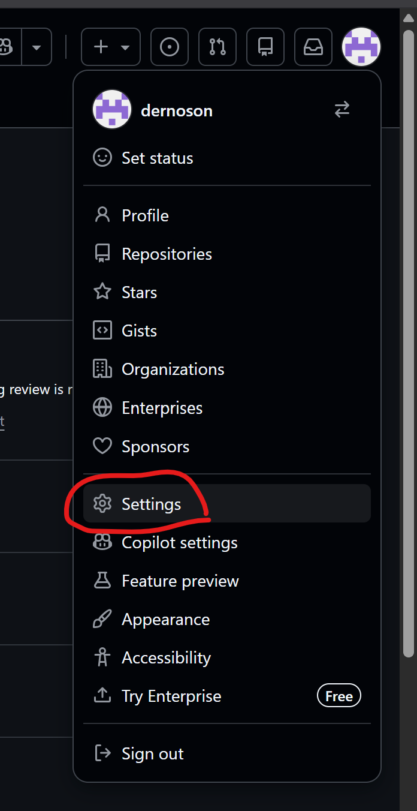
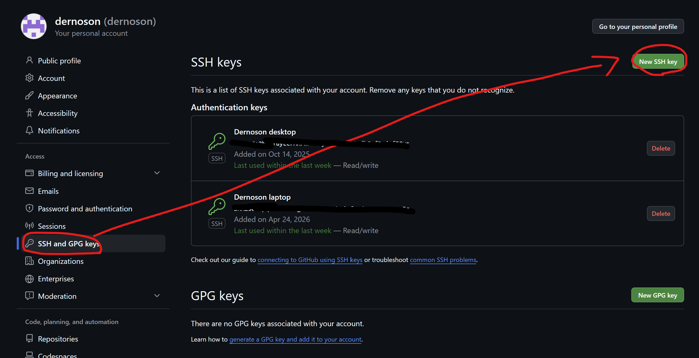
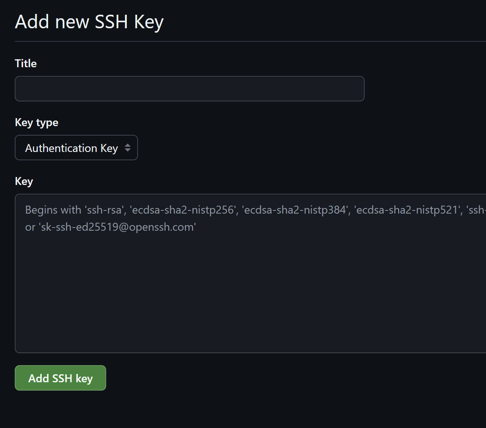

# 怎麼設 github 的 ssh key

1. 打開終端機，輸入：

```bash
ssh-keygen -t ed25519 -C "your_email@example.com"
```

(上面那個 email 記得換成你自己的)

2. 按下 Enter 按鈕，直到完成。
3. 在終端機中輸入：

```bash
cat ~/.ssh/id_ed25519.pub
```

4. 複製輸出結果
5. 打開 github，切換到 settings 頁面。



6. 選擇 "SSH and GPG keys"，按下 "New SSH key" 按鈕。



7. 自己取個名字，把你剛剛複製的貼在下面那框，按下 "Add SSH key" 按鈕，搞定。


