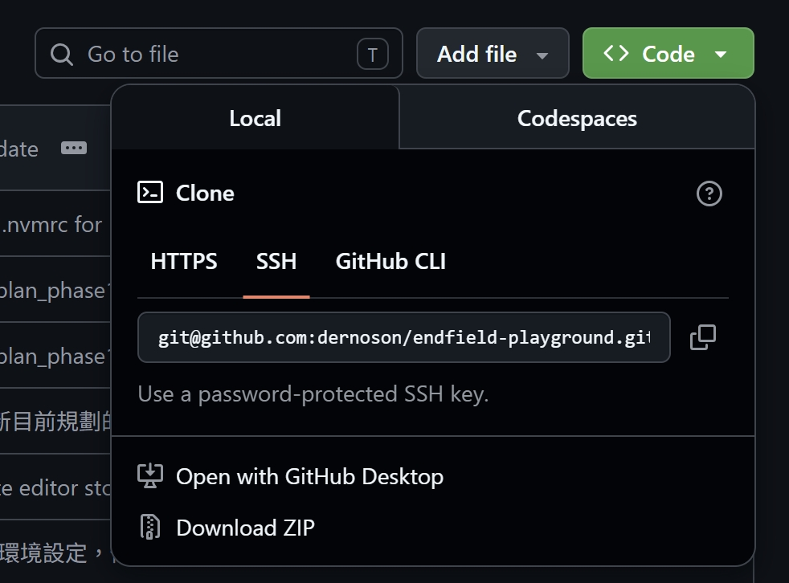
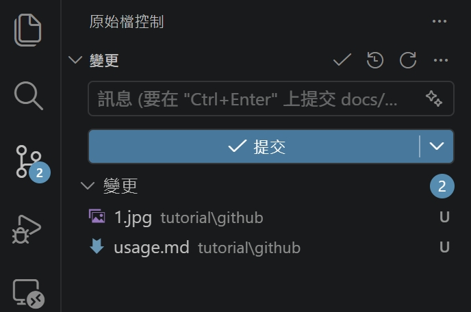
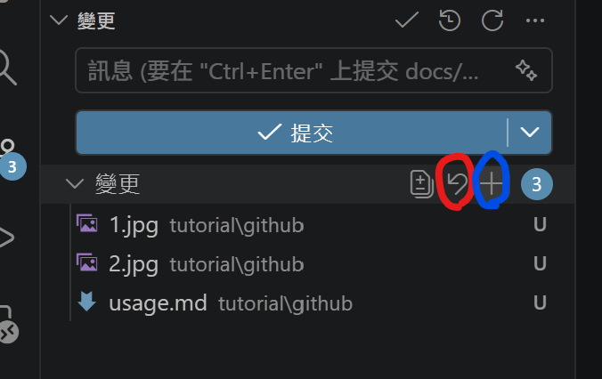
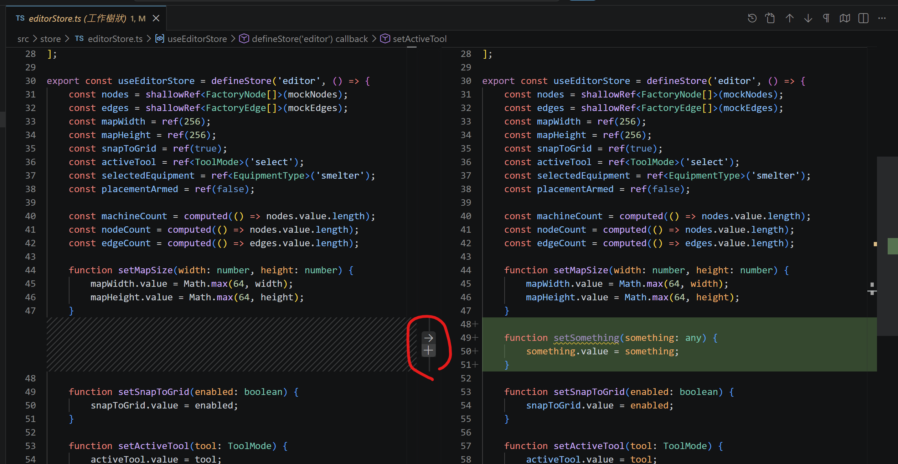
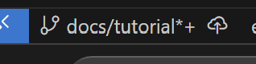
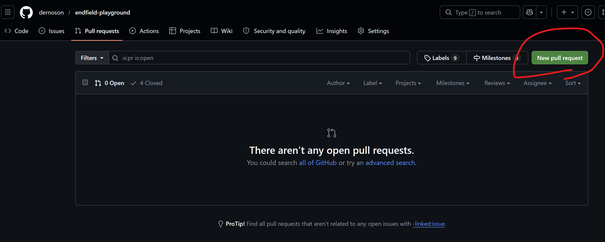
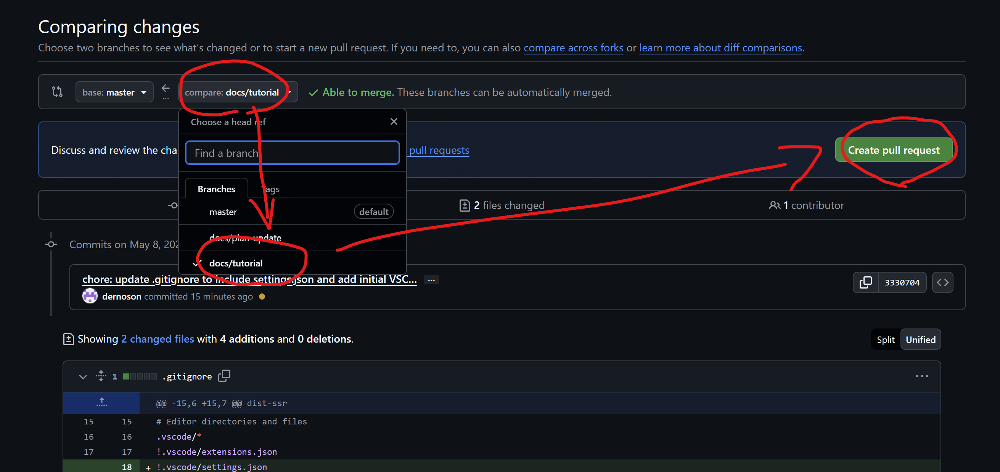
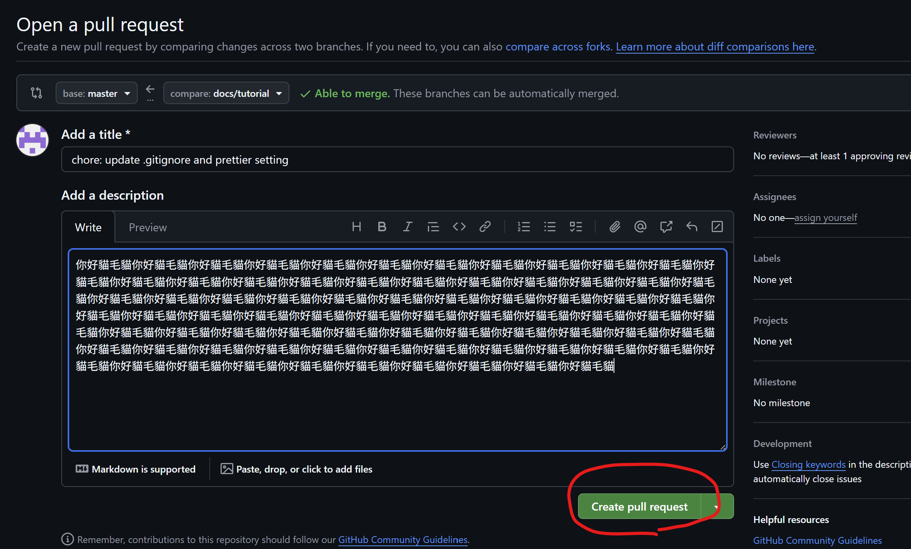

# Github 怎麼用

## 怎麼把 repo 從 github 載下來到電腦裡

1. 前往 https://github.com/dernoson/endfield-playground
2. 點擊 `Code` 按鈕，複製 SSH 連結
   
3. 找一個你喜歡的資料夾，按右鍵，選擇在終端機中開啟
4. 在終端機中輸入 `git clone <SSH 連結>`
    - 沒下載 git 記得去下載
5. 跑完就會看到一個新的資料夾，你就完成了！

## add？commit？push？

(我假設你都在 vscode 上開發)

### add (暫存)

當你新增或是修改檔案，存檔後，左邊 git 圖示會跳出數字，表示有變更東西了。  
點選圖示就會顯示如下：


這兩個檔案目前的狀態是尚未 add 過的，可以理解為尚未暫存起來。  
暫存有很多種方式：

- 打開終端機下指令 `git add .` (我相信你跟我一樣懶不會想用這個)
- 按 "變更" 旁的 "+" 按鈕 (藍色圈圈)，就會把所有變更都暫存起來
    - 按紅色圈起來的還原符號，就會把你所有暫存的東西，還原為你沒改過時的狀態
      
- 每個檔案也有自己的 "+" 與還原按紐，可以各自操作
- 點選這些變更檔案，會顯示成這樣：
  
  這個會實際顯示你的檔案的變更內容比對，你可以點中間 (紅色圈圈) 的按鈕分段選擇要暫存還是還原
- 當暫存了後，就會顯示為 "暫存的變更"，你可以隨時把暫存的東西設回未暫存，再做還原

### commit (提交)

有被暫存的東西，才可以被提交 (commit)。  
提交時你必須輸入上面的提交訊息，說明這次你改了哪些東西。

按下提交後，暫存的紀錄就會消失，恭喜你已經在你 "本地" 完成了一次提交！

### push (上傳)

沒錯，提交其實只是上傳的前一步，你可以提交很多次之後，再一次上傳。

你的 github 左下角會顯示成這樣：



- 你當前處在的 branch 的名稱
- \* 代表有東西還沒暫存
- \+ 代表有東西沒提交
- 雲朵符號代表整個 branch 是新的還沒上傳過
- 向上箭頭可以點，點了就上傳出去了 (通常右邊帶數字，代表有多少提交沒有上傳)
- 可能會出現向下箭頭，代表 github 上有變更你沒下載，點了就會下載下來

**當你發現你有沒下載的東西，請務必先下載下來，再進行後續操作，否則就會發生衝突。**

為何要分提交與上傳呢？有以下原因：

- 上傳之後你就收不回來了
- 你可能提交完之後想反悔了，其實是可以把提交取消掉的  
  (使用終端機或是 git graph)
- 你上傳後，會觸發我設的 CI/CD 流程，會自動檢測你的程式碼型別、語法、格式是否合格，然後 discord 就會通知你結果

### 你在做上傳時，通常會遇到以下問題

#### 衝突

當你沒有先下載最新的東西，自己就改得很開心，一堆提交在本地要上傳，就會這樣。

解法：恭喜你，請把你的所有提交還原乾淨，下載最新的東西，再重新改 code 提交。

**阿不是阿，我看我左下角沒有向下的箭頭阿，怎麼還會衝突**

那是因為，那個箭頭是你有跟 github 同步過，才會顯示的狀態。  
而同步跟下載是兩碼事，怎麼同步呢？
打開終端機，輸入：

```bash
git pull --prune
```

這樣會下載 github 上的最新東西，並且把你的本地跟 github 同步。  
並且，這個指令會把 github 上已經刪除的 branch 也刪除掉。

這個狀況尤其會在你剛被我 merge pull request 後發生，因為我會殺掉你的 branch。

#### 沒權限

當你沒有權限上傳，通常是因為你沒有被我邀請成為 collaborator。  
解法：請跟我說，我會邀請你成為 collaborator。

#### 還是沒權限

因為你沒有設置 ssh key，所以 github 不知道你是誰。  
解法：請看 [ssh 設定教學](./ssh.md)

#### 因為你打算上傳到 master / main branch 導致失敗

對，因為這個 repo 的 master / main branch 被我鎖起來了。  
你必須建自己的 branch，上傳上來後，發 pull request 給我，由我進行核可。

## PR (Pull Request) 是什麼鬼？？？

你開發到一個進度了之後，把這個功能開發完了，要合到主幹分支 (master / main) 時，就會需要發 PR。

打開你的 github，切換到 pull request 頁面，會看到如下：


按下去，會看到：



按完會看到：


寫一寫你做了啥，然後按下 "Create pull request" 按鈕。  
然後就等我品嘗完你端出來的東西，就這樣。

**注意！當我核可後，我會把你這個 branch 刪掉，所以你就別繼續在同一個 branch 上開發了，快點切到另一個 branch 上開發**

**除非你被我退回去了啦呵呵**

## 怎麼新建 branch

一樣在左下角，點 branch name，就會跳出選項，選擇 "建立新分支"，然後輸入 branch name 就可以了。
