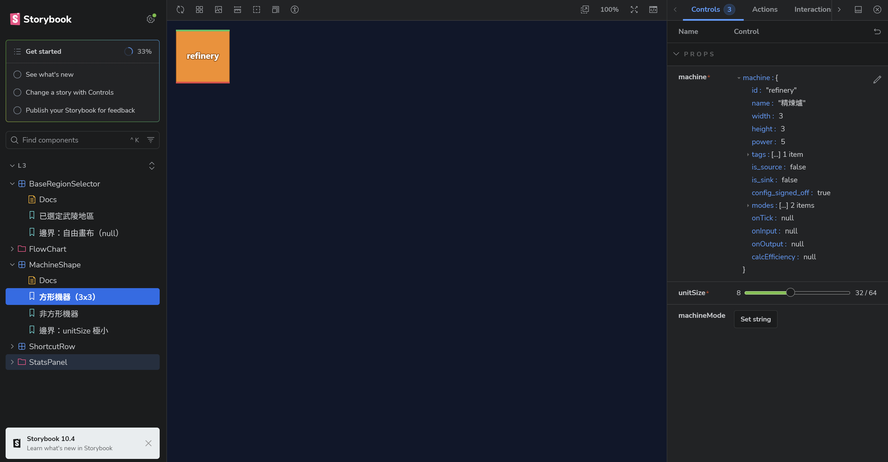
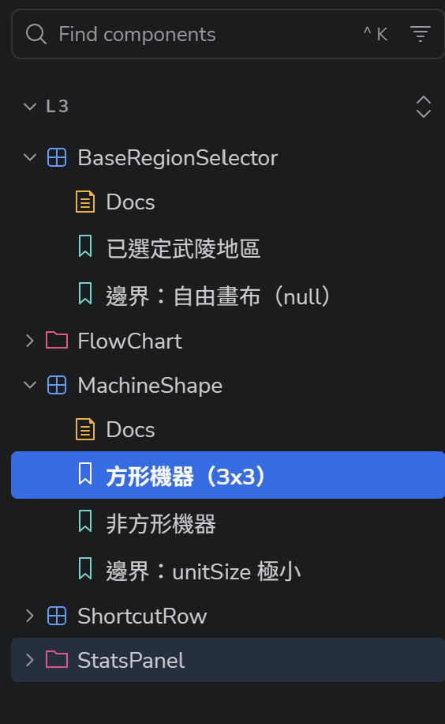
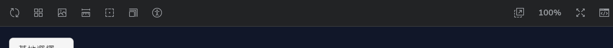
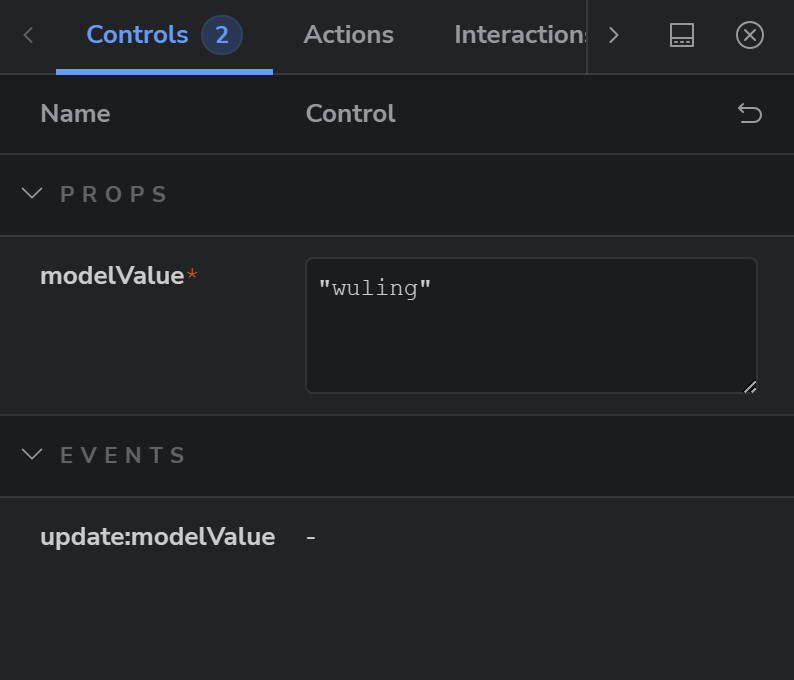
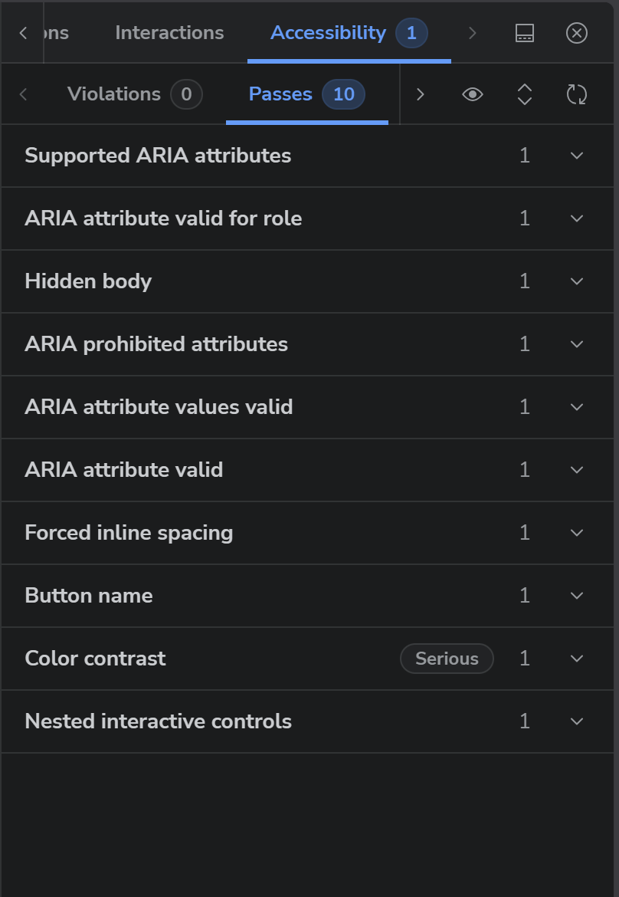

# Storybook 怎麼用（設計師向）

開始之前，先確認你已經照 [根目錄 README](../../README.md) 的「1 環境安裝」把該裝的都裝好了，並且在專案資料夾裡跑過 `pnpm i`。沒裝完的話下面每一步都會失敗。

（這一份不需要你寫任何程式，但確實需要先把環境裝起來，因為 Storybook 是在你自己電腦上跑的。）

---

## 這是什麼

Storybook 是一個把**單一元件從整個畫面裡拆出來單獨看**的地方。

平常你要看一顆按鈕長怎樣，得先把整個 app 跑起來，然後想辦法讓畫面走到那個狀態。Storybook 讓你直接點側欄，就能看到那顆按鈕的每一種狀態——正常、被選取、資料是空的、文字超長——一個個排在那裡。

---

## 怎麼開啟這個畫面

1. 在 terminal 輸入（記得要在 `endfield-playground` 資料夾裡）

    ```bash
    pnpm storybook
    ```

2. 等一段時間（第一次會比較久，它要先處理一堆依賴）
3. 在任意網頁瀏覽器輸入 http://localhost:6006，就會看到這個畫面
   
4. 想關掉，回到 terminal 按 `Ctrl + C`

`pnpm dev`（主畫面，5173）跟 `pnpm storybook`（元件，6006）是兩個不同的東西，可以同時開著。

---

## 怎麼跟這個畫面互動

畫面分成三塊：

| 位置 | 它叫 | 白話 |
| --- | --- | --- |
| 左邊 | Sidebar | 有哪些元件、每個元件有哪些狀態 |
| 中間 | Canvas | 這個元件單獨長什麼樣 |
| 下面 | Addon panel | 改參數、看檢查結果的地方 |

### 左邊側欄



由上而下是三層：

- **資料夾**（例如 `StatsPanel`）＝ 一組元件
- **有方框圖示的**（例如 `PowerSummary`）＝ 一個元件
- **底下的葉節點**（例如「供電盈餘」「邊界：供電不足」）＝ 一個 **story**，也就是這個元件的一種狀態

每個元件底下還會有一個 **`Docs`**，那是這份元件的說明頁，會列出它接受哪些參數、每個參數是幹嘛的。

### 中間 Canvas

只有這個元件，沒有其他東西。上方那排小圖示可以：



- 重新整理（改壞了就按它）
- 換背景色
- 換 viewport 寬度（看手機／平板／桌機的樣子）
- 縮放
- **在新分頁單獨打開這個 story**（乾淨畫面，適合截圖）

### 下面或右邊 Controls



這裡可以直接改參數，Canvas 會馬上跟著變。

**改了不會存檔**，重新整理就回到原狀。所以放心亂調，弄不壞任何東西。

### 網址可以直接分享

網址長這樣：

```
http://localhost:6006/?path=/story/l3-statspanel-powersummary--deficit
```

複製給工程師，他打開就是你看到的同一個畫面。

---

## 怎麼互動以確認設計內容符合構想

### 一、先把所有狀態點過一遍

側欄上一個元件底下列的每一個 story，就是工程師實作出來的每一種狀態。**一個個點過去**，對照你的設計稿看有沒有漏。

名字裡有「邊界」的那些特別要看，那是極端情況：資料是空的、數字是 0、文字超長、值是「未計算」。這些通常設計稿上不會畫，但使用者一定會遇到。

如果你的設計稿有某個狀態，但側欄裡找不到對應的 story——那就是漏了，要回報。

### 二、用 Controls 自己造狀態

側欄列的是工程師想到的狀態。你可以用下面的 Controls 造出他沒想到的：

- 把文字改成很長的一串，看會不會爆版
- 把數字改成 0、負數、很大的數
- 把某個值清空

這是最容易抓到問題的做法，而且不用麻煩任何人。

### 三、用 viewport 看不同寬度

上方工具列的 viewport 圖示可以切換手機／平板／桌機。RWD 的設計是你負責的，這裡可以直接驗。

### 四、看 Accessibility 分頁



每次 story 渲染完，Storybook 會自動拿一個叫 axe-core 的開源檢查引擎掃一遍畫面，結果分成三欄：

| 欄位 | 意思 |
| --- | --- |
| Violations | 規則檢查失敗 |
| Passes | 規則檢查通過 |
| Inconclusive | 引擎判不出來，需要人看一眼 |

`Inconclusive` 最常見的成因是文字疊在圖片、漸層或半透明背景上，引擎拿不到背後真正的顏色，就算不出對比度。這種要你自己看。

**這三個數字是參考值，不是通過與否的判準。**

機器只檢查得到對比度、圖片替代文字、表單標籤、ARIA 屬性、標題階層這幾類；檢查不到的是鍵盤能不能走完整個流程、Tab 順序合不合理、焦點框看不看得到、螢幕閱讀器唸起來通不通——那些仍然要人實際操作。

所以 `Violations` 非零時值得回報，它指出來的通常是真的；是 0 的時候不代表這個元件的無障礙沒問題，該用的人工判斷還是要用。

### 五、對不上的時候怎麼回報

附這四樣，工程師才不用來回問：

1. **元件名**（側欄上那個，例如 `PowerSummary`）
2. **story 名**（例如「邊界：供電不足」）
3. **網址**（直接複製瀏覽器網址列）
4. **截圖**，如果你有改過 Controls 的參數，也一起寫上改了什麼

---

## 有些事不該在這裡看

- **元件之間的間距、整個畫面的排版**：那是「把元件組起來」的工作，不屬於單一元件。要看整體請開 http://localhost:5173。
