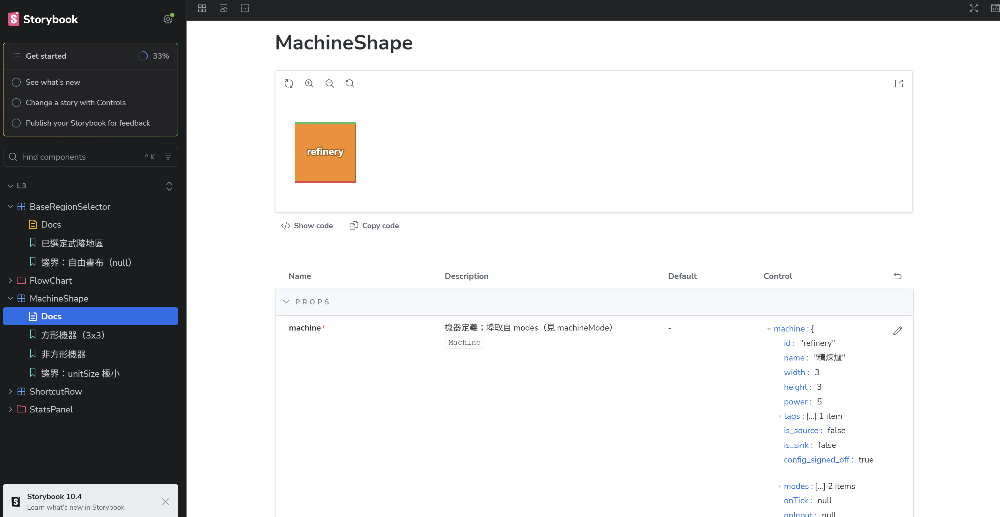

# Storybook 怎麼用（開發者向）

開始之前，先確認你已經照 [根目錄 README](../../README.md) 的「1 環境安裝」把該裝的都裝好了，並且在專案資料夾裡跑過 `pnpm i`。沒裝完的話下面每一步都會失敗。

---

## 怎麼開啟這個畫面

1. 在 terminal 輸入（記得要在 `endfield-playground` 資料夾裡）

    ```bash
    pnpm storybook
    ```

2. 等一段時間（第一次會比較久，它要先處理一堆依賴）
3. 在任意網頁瀏覽器輸入 http://localhost:6006，就會看到這個畫面
   
4. 想關掉，回到 terminal 按 `Ctrl + C`

`pnpm dev` 跟 `pnpm storybook` 是兩個不同的東西，port 也不一樣（5173 跟 6006），你可以兩個同時開著，互不影響。

---

## 怎麼跟這個畫面互動

畫面分成三塊，先認一下名字，後面講起來比較快：

| 位置 | Storybook 叫它 | 白話 |
| --- | --- | --- |
| 左邊 | Sidebar | 有哪些元件、每個元件有哪些狀態 |
| 中間 | Canvas | 這個元件單獨長什麼樣 |
| 下面 | Addon panel | 改參數、看檢查結果的地方 |

### 左邊側欄


- **資料夾**（例如 `StatsPanel`）＝ 一組元件
- **有方框圖示的**（例如 `PowerSummary`）＝ 一個元件
- **底下的葉節點**（例如「供電盈餘」「邊界：供電不足」）＝ 一個 **story**，也就是這個元件的一種狀態
- **`Docs`** ＝ 這個元件的說明頁，會列出它吃哪些 props

### 中間 Canvas

只有這個元件，沒有其他東西。上方那排小圖示可以：重新整理、換背景色、換 viewport 寬度、縮放、以及**在新分頁單獨打開這個 story**。

### 下面或右邊 Controls


這裡可以直接改參數，Canvas 會馬上跟著變。改了不會存檔，重新整理就回到原狀，可以放心亂調。

### 網址可以直接分享

網址長這樣：

```
http://localhost:6006/?path=/story/l3-statspanel-powersummary--deficit
```

複製給同事，他打開就是同一個 story。回報問題的時候附上它最省事。

---

## 怎麼把自己設計好的元件掛進 storybook

### 一、檔案放哪、叫什麼

跟你的元件放同一個資料夾，檔名是 `<元件檔名>.stories.ts`。

```text
src/components/StatsPanel/
├─ PowerSummary.vue          ← 你的元件
└─ PowerSummary.stories.ts   ← 你要新增的
```

### 二、最小骨架（直接抄了改）

```ts
import type { Meta, StoryObj } from '@storybook/vue3-vite';
import PowerSummary from './PowerSummary.vue';

const meta = {
    title: 'L3/StatsPanel/PowerSummary',
    component: PowerSummary,
} satisfies Meta<typeof PowerSummary>;

export default meta;
type Story = StoryObj<typeof meta>;

/** 供電充足：盈餘以綠色呈現 */
export const Surplus: Story = {
    name: '供電盈餘',
    args: {
        totalDemandKw: 320,
        totalSupplyKw: 500,
        deviceCount: 18,
        deviceErrorCount: 0,
        connectionCount: 16,
    },
};
```

`args` 就是你的 props。你的 `defineProps` 上面寫的註解，會自動變成 Docs 頁的說明欄，所以註解寫好一點對你自己有好處。



### 三、三個規則

1. `title` 一律寫 `L3/<資料夾>/<元件>`，這樣側欄才會照資料夾分組
2. `export` 的名字用英文（那是 JS 變數名），顯示用的中文寫在 `name`
3. **每個元件至少兩個 story**：一個預設，一個邊界（空資料、極端值、`null`、超長文字之類）

第 3 點是重點。只有預設 story 的話，Storybook 只是個好看的展示櫃，抓不到問題。

### 四、如果你的元件有用到 Nuxt UI

例如 `UButton`、`UKbd`。**什麼都不用做**，照上面的骨架寫就好，Nuxt UI 已經在 `.storybook/preview.ts` 裡註冊過了。

### 五、如果你的元件是 FlowChart 底下的節點或連線

這種不能直接掛。因為它們的 props（`selected`、`sourceX`、`targetY` 這些）是 Vue Flow 畫布在渲染時算出來的，不是你傳進去的，直接掛會缺東西而壞掉。

要用 `.storybook/vueFlowHarness.ts` 這個工具，它會把你的元件放進一個真正的畫布裡：

```ts
import type { Meta, StoryObj } from '@storybook/vue3-vite';
import { nodeHarness } from '../../../.storybook/vueFlowHarness';
import MaterialNode from './MaterialNode.vue';

/** 這個元件實際吃的是 NodeProps 的 data，story 只需要餵這一塊 */
type MaterialNodeArgs = {
    data: { label: string; ratePerMin: number };
    selected?: boolean;
};

const meta: Meta<MaterialNodeArgs> = {
    title: 'L3/FlowChart/MaterialNode',
    render: nodeHarness(MaterialNode, 'sb-material-node'),
};

export default meta;
type Story = StoryObj<MaterialNodeArgs>;

/** 一般情形 */
export const Default: Story = {
    name: '一般供給',
    args: { data: { label: '鐵礦砂', ratePerMin: 60 } },
};
```

連線元件用 `edgeHarness`，用法一樣。

注意這種 story 的 `meta` **不寫 `component`**。寫了的話 Storybook 會要求你把 Vue Flow 那三十幾個 props 全部填一遍，而且 Docs 的參數表只會列出 Vue Flow 的介面，不是你元件真正在乎的 `data`。

---

## 幾件會踩到的事

- **不要在 `.storybook/preview.ts` 註冊 Pinia。** L3 元件本來就不准 import store，註冊了反而會讓違規的元件看起來能動，把問題藏起來。
- **story 寫不出來，通常是元件的 props 介面有問題，不是 story 的問題。** 這種時候回報給 L1，不要為了讓 story 好寫去改元件。
- **改了 `.storybook/preview.ts` 的 `import` 之後要重啟。** 熱更新不會把新的 CSS import 帶進來，你會看到樣式整個掉光。`Ctrl + C` 之後重跑 `pnpm storybook`。
- **Tailwind 的任意值一定要帶單位。** `h-[600]` 不會產生任何 CSS，要寫 `h-[600px]`。這個在畫面上看起來就是「元件消失了」，很難查。

---

## Accessibility 分頁是什麼

下面面板有一個 **Accessibility** 分頁。每次 story 渲染完，它會自動拿 axe-core（一個開源的無障礙檢查引擎）掃一遍畫面上的 DOM，結果分成三欄：

| 欄位 | 意思 |
| --- | --- |
| Violations | 規則檢查失敗 |
| Passes | 規則檢查通過 |
| Inconclusive | 引擎判不出來，需要人看一眼 |

`Inconclusive` 最常見的成因是文字疊在圖片、漸層或半透明背景上，引擎拿不到背後真正的顏色，就算不出對比度。

**這三個數字是參考值，不是通過與否的判準。**

它掃的是渲染後的畫面，只查得到「機器看得出來」的東西：對比度、圖片有沒有替代文字、表單控制項有沒有標籤、ARIA 屬性用得對不對、標題階層有沒有跳號。

查不到的更多：鍵盤能不能走完整個流程、Tab 順序合不合理、焦點框看不看得到、螢幕閱讀器唸出來通不通。這些都要人實際操作。

所以 `Violations` 是 0 的意思是「可機檢的那部分沒抓到問題」，不等於這個元件無障礙。反過來，出現非零就值得看一眼，它指出來的通常是真的。

沒有任何流程會因為這個數字擋你，它不進 CI。

---

## 交出去之前

跟平常一樣：

```bash
pnpm format
pnpm lint-check
pnpm type-check
```

另外點開你的 story，看一下 **Accessibility** 分頁有沒有 `Violations`。有的話讀一下它說什麼，通常是真的問題；沒有的話也不代表就無障礙了，上一節有講。
